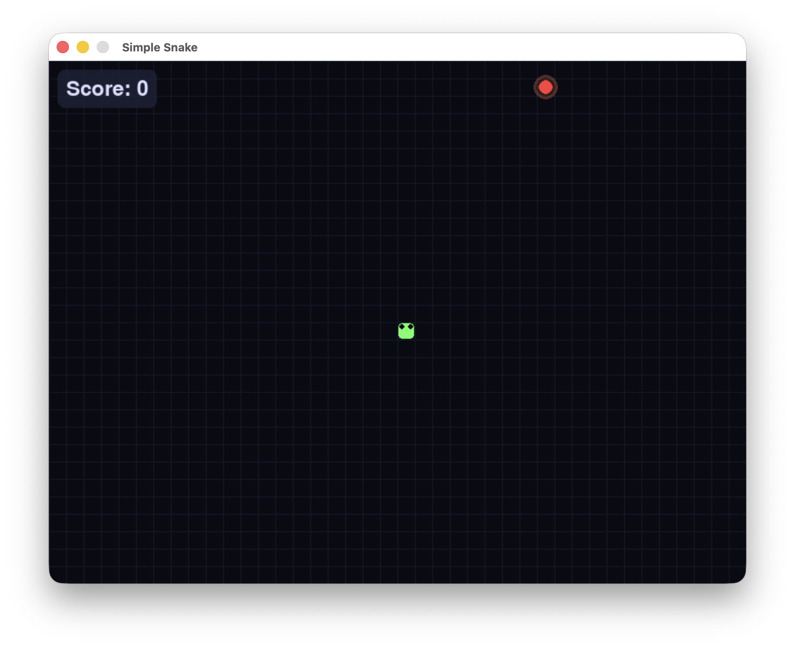

# SimpleSnake

A classic Snake game built with Pygame, featuring a modern dark theme and polished visuals.



## Features
- Smooth arrow key and WASD controls
- Gradient snake body with animated eyes
- Pulsing glow effect on food
- Dark theme with subtle grid background
- Score display with styled panel
- Game over screen with restart option

## Requirements
- Python 3.6+
- Pygame 2.0+

## How to Run
```bash
pip install pygame
python snake.py
```

## Controls
| Key | Action |
|-----|--------|
| ← → ↑ ↓ / A D W S | Move snake |
| R | Restart on game over |
| Q | Quit on game over |

## License
This project is licensed under the MIT License - see the [LICENSE](LICENSE) file for details.
